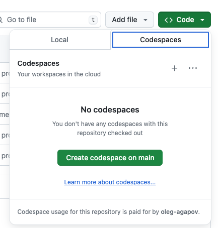

# dbt unit testing demo

This is a demo project that demonstrates native [unit tests](https://docs.getdbt.com/docs/build/unit-tests) in dbt.

You can try this project in Github Codespaces. First, create a codespace in the current repo by clicking Code -> "Create codespace on main"



It may take a couple of minutes to create an environment.

Install dbt in virtual environment by running:

```bash
python -m venv venv
source venv/bin/activate
pip install -r requirements.txt
```

Next, start local Postgres database:

```bash
docker compose up -d
```

Check that everything is up and running (your should see `All checks passed!`):

```bash
cd dbt_unit_testing/
dbt debug
```

Create seeds and run the project:

```bash
dbt seed
dbt run
```

Try unit tests with (you will get an error if you skipped previous step:

```bash
dbt test -s test_type:unit
```
